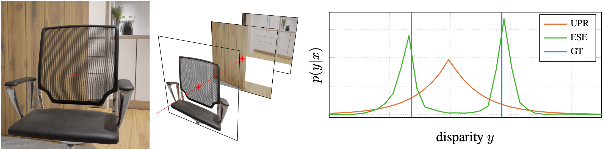

# Towards Multimodal Depth Estimation from Light Fields
Implementation of our (paper)[https://arxiv.org/pdf/2203.16542.pdf] published at CVPR 2022.



## Requirements
* Python 3.8 or higher
* NVidia GPU

## Installation
First, download the network checkpoints and the dataset [here](https://drive.google.com/drive/folders/1bxfFCbXlVR6LJB7LTbyLD5_0OfgXVALi?usp=sharing) and unzip both.
```sh
unzip mmlf-dataset.zip
unzip mmlf-params.zip
```
Next, clone this repository.
```sh
git clone https://github.com/titus-leistner/mmlf.git
```
For the installation we recommend a python venv.
```sh
cd mmlf/
python3 -m venv .
source bin/activate
pip install -r requirements.txt
```

## Reproduction of Experiments
To reproduce our trainings, run:
```sh
# BASE
python -m mmlf.train.cli ../mmlf-params/base-um  --train_trainset=../mmlf-dataset/train --train_shift=2.5 --train_valset=../mmlf-dataset/val --train_lr=1e-3 --train_bs=512 --train_ps=96  --train_warm_start

# UPR
python -m mmlf.train.cli ../mmlf-params/upr-um  --train_trainset=../mmlf-dataset/train --train_shift=2.5 --train_valset=../mmlf-dataset/val --train_lr=1e-3 --train_bs=512 --train_ps=96  --train_warm_start --model_uncert

# ESE
python -m mmlf.train.cli ../mmlf-params/ese-um  --train_trainset=../mmlf-dataset/train --train_shift=2.5 --train_valset=../mmlf-dataset/val --train_lr=1e-3 --train_bs=512 --train_ps=96  --train_warm_start --model_uncert

# DPP
python -m mmlf.train.cli ../mmlf-params/dpp-um  --train_trainset=../mmlf-dataset/train --train_shift=2.5 --train_valset=../mmlf-dataset/val --train_lr=1e-3 --train_bs=512 --train_ps=96  --train_warm_start --model_uncert --val_ensamble
```

To use the multimodal loss, add `--train_loss_multimodal`. Please note that we trained on a system with 8 NVidia A100 GPUs. I you want to train on a smaller system (which also works fine), you have to adjust learning rate and batch size to your needs.

To reproduce inference, run:
```sh
# BASE
python -m mmlf.validate.cli  --train_shift=2.5  ../mmlf-params/base-um ../mmlf-dataset/val

# UPR
python -m mmlf.validate.cli  --train_shift=2.5  ../mmlf-params/upr-um ../mmlf-dataset/val

# ESE
python -m mmlf.validate.cli  --train_shift=2.5 --val_ensamble  ../mmlf-params/ese-um ../mmlf-dataset/val

# DPP
python -m mmlf.validate.cli  --train_shift=2.5 --model_discrete  ../mmlf-params/dpp-um ../mmlf-dataset/val

```

## Project Organization

    ├── LICENSE                                 <- The License
    │
    ├── README.md                               <- The top-level README for developers using this project.
    │
    ├── requirements.txt                        <- The requirements file for reproducing the analysis environment, e.g.
    │                                              generated with `pip freeze > requirements.txt`
    │
    ├── mmlf           <- Source code for use in this project.
    │   │
    │   ├── data                                <- Scripts to download or generate data
    │   │
    │   ├── model                               <- Scripts defining the neural network models
    │   │
    │   ├── utils                               <- Scripts utilities used during data generation or training
    │   │
    │   ├── train                               <- Scripts to train models
    │   │
    │   ├── validate                            <- Scripts to validate models
    │   │
    │   └── visualize                           <- Scripts to create exploratory and results oriented visualizations

## Citation
```bibtex
@article{leistner2022multimodal,
    title={Towards Multimodal Depth Estimation from Light Fields},
    author={Leistner, Titus and Mackowiak, Radek and Ardizzone, Lynton and K{\"o}the, Ullrich and Rother, Carsten},
    journal={arXiv preprint arXiv},
    year={2022}
}
```
